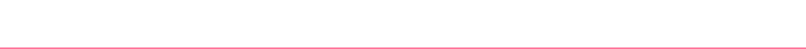

  

  

I'm a Cybersecurity undergraduate interested in Linux, DevOps, and automation. I enjoy exploring system administration, open-source technologies, and deepening my understanding of operating systems. I'm also learning Android development to broaden my technical skill set.

  

  

  

  

  

  

  

  

  

  

  

  
  
  
  
  
  

  

  

  

